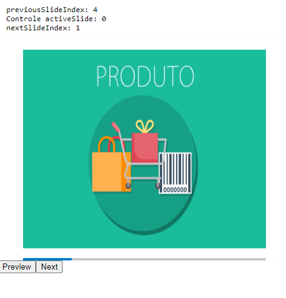

# Carrousel Slide with Angular 9

Projeto desenvolvido com Angular v9

# Preview




# 🚀Description

Criação de um componente de slide com barra de indicação de imagem, botões para troca de imagem e indicadores de imagem

## 🔨Start Application


Install
```
npm i or yarn
```
Start


```
ng serve
```


Navigate to `http://localhost:4200`
# Development server


## Build


Run `ng build`


## Running unit tests


Run `ng test`


Projeto desenvolvido by <a href='https://github.com/victorcmarinho/'>Victor Marinho</a>